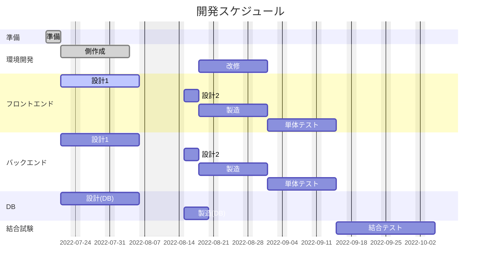

# CareConne

仕様:  
チャット系アプリ  
カリキュラムの攻略方法が載っている  

目的:  
カリキュラム生の横の繋がりを作り、進捗率を上げる。

機能：  

前半戦:  
チャット機能  
CRUD  
部屋でマッチング（1-1部屋,4-2部屋のように今取り掛かっているカリキュラムの部屋）  
チャットに対して言い値ができる  
マイページ（自己紹介、アイコン画像、名前、入社び、年齢、ステータス（進捗））  
  
後半戦:  
レベル機能（投稿した記事に対して「いいね」がつき、その数でレベルが上がる仕組み。）  
→営業もカリキュラム生の出来高が見える化できる。　　
ランキング（月単位で「いいね」の獲得数ランキング。）　　

ルール：  
綺麗に作ろう。　　

言語：  
フロント:React＋Vue,Jquery  
バックエンド:Python(FLSK、django)  
DB:Postgres  
サーバ:ロリポップ!  
チケット:git Redmine  
設計ツール:画面繊維図→Figma,画面仕様図→ルシッドチャート,ER図→スプレットシート  
その他　:Docker,git  

### 前半戦スケジュール

